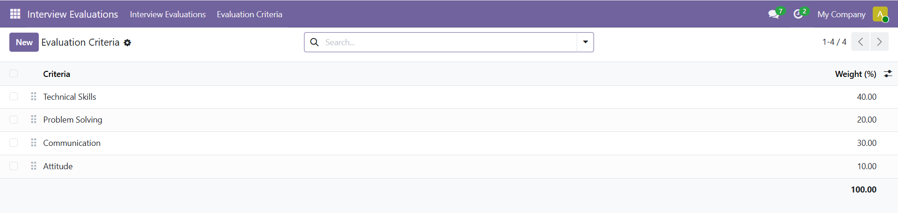
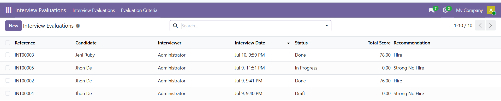
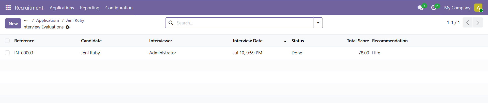
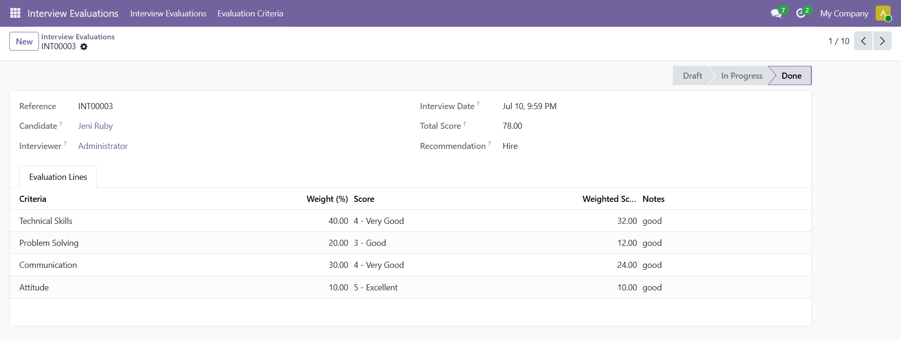

# HR Interview Evaluation
Structured interview evaluation for Odoo Recruitment with weighted scoring, automated recommendations, workflow management, and Recruitment integration.
 
## Overview
HR Interview Evaluation extends the Odoo Recruitment module by providing a structured and reusable interview evaluation process.
 
Instead of relying on free-text interview notes, interviewers evaluate applicants using predefined weighted criteria. The system automatically calculates the total score and generates a hiring recommendation.
 
## Key Features
 
### 📑 Evaluation Criteria
- Define reusable interview evaluation criteria.
- Assign percentage weights to each criterion.
- Drag & drop to reorder criteria.
- Archive criteria instead of deleting them.
- Active criteria must always total 100% before an interview evaluation can be created.
- Prevent duplicate criterion names.
- Prevent zero or negative weights.
### 📝 Interview Evaluation
- Automatically generate interview references **(INT00001, INT00002, ...)**.
- Automatically generate evaluation lines from active criteria.
- Score each criterion from **1 (Poor)** to **5 (Excellent)**.
- Automatically calculate:
    - Weighted score
    - Total interview score
- Automatically determine the hiring recommendation.
**Recommendation Rules**
 
| Total Score | Recommendation |
|---|---|
| ≥ 90 | Strong Hire |
| ≥ 75 | Hire |
| ≥ 60 | No Hire |
| < 60 | Strong No Hire |
 
### 🔄 Workflow
Each evaluation follows a simple status flow:
 
```
Draft → In Progress → Done
           ↓
       Cancelled → Draft (reset)
```
 
**Available Actions**
- Start Interview
- Mark as Done
- Cancel
- Reset to Draft
**Business Rules**
- Every evaluation line must have a score before completion.
- Interview dates cannot be earlier than today.
- Completed evaluations become read-only.
- Completed evaluations cannot be deleted.
### 👥 Recruitment Integration
A **Smart Button** is added to the Applicant form.
 
It allows users to:
- View the number of interview evaluations.
- Open all evaluations related to the applicant.
- Quickly create additional evaluations.
## 📂 Menu Structure
 
```
Interview Evaluations
├── Interview Evaluations
└── Evaluation Criteria
```
 
## 🗃️ Models
 
| Model | Description |
|---|---|
| `hr.evaluation.criteria` | Reusable, weighted evaluation criteria |
| `hr.interview.evaluation` | Interview evaluation header (candidate, interviewer, date, status, total score, recommendation) |
| `hr.interview.evaluation.line` | One scored line per criterion within an evaluation |
 
## 🛠️ Typical Usage
 
1. Configure **Evaluation Criteria**.
2. Ensure active weights total **100%**.
3. Create an Interview Evaluation.
4. Click **Start Interview**.
5. Score every criterion.
6. Click **Mark as Done**.
7. Review the automatic recommendation.
## 📸 Screenshots
 
### Evaluation Criteria

 
### Interview Evaluations List

 
### Smart Button on Applicant

 
### Candidate Interview Evaluation List

 
### Interview Evaluation Form

 
## 🔐 Access Rights
Internal Users (`base.group_user`) can:
 
- Read
- Create
- Edit
- Delete
for:
 
- Evaluation Criteria
- Interview Evaluation
- Interview Evaluation Line
## ⚙️ Technical Notes
- Uses a dedicated `ir.sequence`.
- Prefix: `INT`
- Padding: `5`
- Example:
```
INT00001
INT00002
INT00003
```
 
Validation rules include:
 
- Active criteria weight must equal **100%**.
- Weight must be greater than zero.
- Criteria names must be unique.
- Interview date cannot be earlier than today.
- Completed evaluations cannot be modified.
- Completed evaluations cannot be deleted.
### 👩‍💻 Module Information
 
| Property | Value                  |
| -------- | ---------------------- |
| Version  | **19.0.1.0.0**         |
| License  | LGPL-3                 |
| Category | Human Resources        |
| Depends  | `hr`, `hr_recruitment` |
| Author   | **Fauza Lutfia**       |